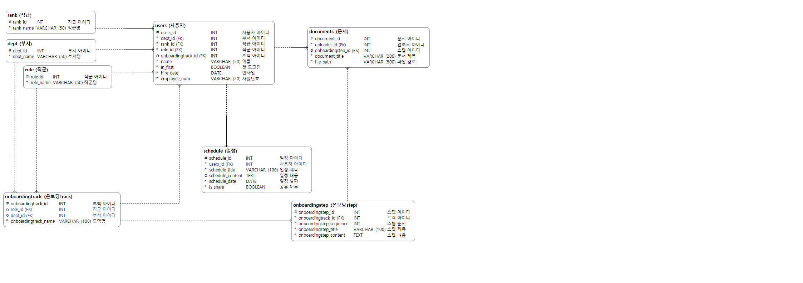

# 🧭 온보딩 시스템 (Onboarding System)

> 부서·직군별 온보딩 트랙을 배정하고, 문서·캘린더까지 한 곳에서 관리하는 사내 온보딩 웹 시스템

---

## 📌 프로젝트 소개

신입 직원의 온보딩 과정은 부서마다 방식이 제각각이고, 안내 문서와 일정이 여러 곳에 흩어져 있어 관리가 번거롭습니다.
**온보딩 시스템**은 부서·직군 조건에 맞는 온보딩 트랙을 관리자가 미리 구성해두고, 신입 직원이 로그인 후 자신에게 배정된 트랙을 순서대로 확인할 수 있게 만든 웹 서비스입니다.

- 개발 형태: 개인 프로젝트
- 개발자: 황인규

## ✨ 핵심 기능

| 기능 | 설명 |
|---|---|
| 🗂 온보딩 트랙 관리 | 부서/직군 조건으로 온보딩 커리큘럼(트랙)을 구성, 신입 직원은 배정된 트랙을 순서대로 열람 |
| 📄 문서 관리 | 사내 문서를 S3에 업로드/보관, 특정 온보딩 단계 첨부 또는 독립 문서로 열람 |
| 📅 캘린더 | 개인/공유 일정을 하나의 모델로 관리 (플래그 토글 방식, 데이터 중복 없음) |
| 👤 조직/사용자 관리 | 부서·직군·직급을 독립 엔티티로 관리, 사원번호 기반 로그인, 첫 로그인 시 비밀번호 변경 강제 |
| 🛠 관리자 기능 | 부서/직군/직급/트랙/문서/직원 CRUD, 신입 직원 트랙 배정 |

## 🛠 기술 스택

| 영역 | 스택 |
|---|---|
| Backend | Django, Django REST Framework, MySQL |
| Frontend | React, TypeScript, Vite |
| Infra | AWS EC2, AWS S3, Docker Compose |
| 설계 | vuerd (ERD) |

## 📂 폴더 구조

```
onboarding_system/
├── README.md                ← 지금 보고 계신 파일
├── 산출물/                    ← 설계 문서 (기획서, 요구사항정의서, WBS, ERD 등)
│   └── ERD/
└── 시스템/                    ← 실행 가능한 소스코드 (Django + React)
    └── README.md             ← 설치·실행 방법은 여기 참고
```

## 🗂 산출물

| 문서 | 설명 |
|---|---|
| 기능 요구사항 정의서 | 시스템이 해야 할 일을 정의한 문서 |
| WBS | 작업 분해 구조 및 일정 계획 |
| 데이터베이스 설계서 (ERD) | 8개 테이블 구조, 관계, 제약조건 정의 |
| 시스템 아키텍처 설계 문서 | 폴더 구조와 앱 분리 근거 |

## 🖼 ERD



## ⚙️ 실행 방법

설치 및 실행 방법은 [`시스템/README.md`](./시스템/README.md)를 참고해 주세요.